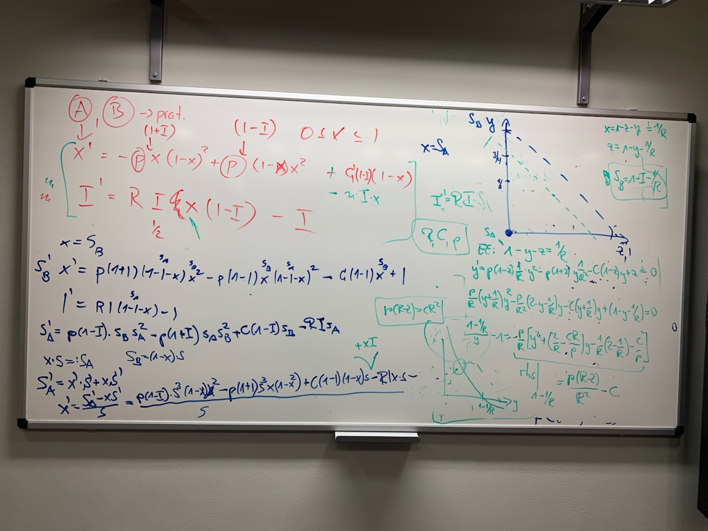

# Simple Disease–Behaviour Model

Simulates a coupled SIS epidemic and behavioural dynamics system. Two state variables evolve together:

- **x** — fraction of the population adopting risky/normal behaviour (non-protective)
- **I** — fraction of the population infected

Behaviour influences transmission (via `x` in the force of infection), and infection pressure shifts behaviour adoption. The model is analysed for equilibria and simulated as a continuous dynamical system.

## Model derivation



## Setup

Install Julia dependencies:

```bash
julia --project=. -e 'using Pkg; Pkg.instantiate()'
```

Set up pre-commit hooks (requires Python):

```bash
pip install pre-commit
pre-commit install
```

## How to run

Trajectory simulation:

```bash
julia --project=. main.jl
```

Hopf bifurcation analysis:

```bash
julia --project=. hopf_analysis.jl
```

Both scripts share the parameters defined in `src/params.jl`.

## Output

All plots are saved to `figs/` (configurable via `figs_path` in `src/params.jl`).

`main.jl`:

- `f1.png` — phase portrait (x vs I)
- `ft.png` — time series of I

`hopf_analysis.jl`:

- `hopf_phase_Rd.png` — (R, d) parameter plane coloured by stability of the most-stable endemic equilibrium: blue = stable fixed point, red = all equilibria unstable (stable limit cycle), grey = disease-free. The black contour is the stability boundary (Hopf curve + transcritical boundary).
- `hopf_phase_Rp.png` — Hopf critical curve p_c(R) and limit-cycle frequency ω(R) at fixed d = d₀
- `hopf_limit_cycle.png` — phase portrait of the stable limit cycle at (R₀, p₀, c₀); two trajectories started from inside and outside converge to the same orbit; unstable equilibria marked with ✕

See [`ANALYSIS.md`](ANALYSIS.md) for a detailed explanation of the parameter space structure and the diagnostic used.

## File structure

| File                  | Purpose                                                                 |
| --------------------- | ----------------------------------------------------------------------- |
| `main.jl`             | Entry point: loads packages, runs simulation, produces plots            |
| `hopf_analysis.jl`    | Hopf bifurcation analysis: parameter-plane figures                      |
| `src/params.jl`       | Shared model parameters (R₀, p, c, simulation time, solver settings)    |
| `src/model.jl`        | ODE right-hand side and initial condition validator                     |
| `src/equilibria.jl`   | Jacobian, eigenvalue analysis, equilibrium finder                       |
| `src/hopf.jl`         | Hopf bifurcation utilities: critical p_c and frequency ω                |
| `src/trajectories.jl` | Trajectory simulation wrappers                                          |
| `src/plots.jl`        | Figure functions: `plot_heatmap_Rd`, `plot_hopf_Rp`, `plot_limit_cycle` |

## Key parameters (`src/params.jl`)

These parameters are used by both `main.jl` and `hopf_analysis.jl`.

| Parameter | Value | Meaning                              |
| --------- | ----- | ------------------------------------ |
| `R0`      | 3.0   | Basic reproduction number            |
| `p0`      | 1.05  | Imitation rate                       |
| `c0`      | 0.19  | Spontaneous behaviour switching rate |
| `T`       | 100   | Simulation time (main.jl only)       |
